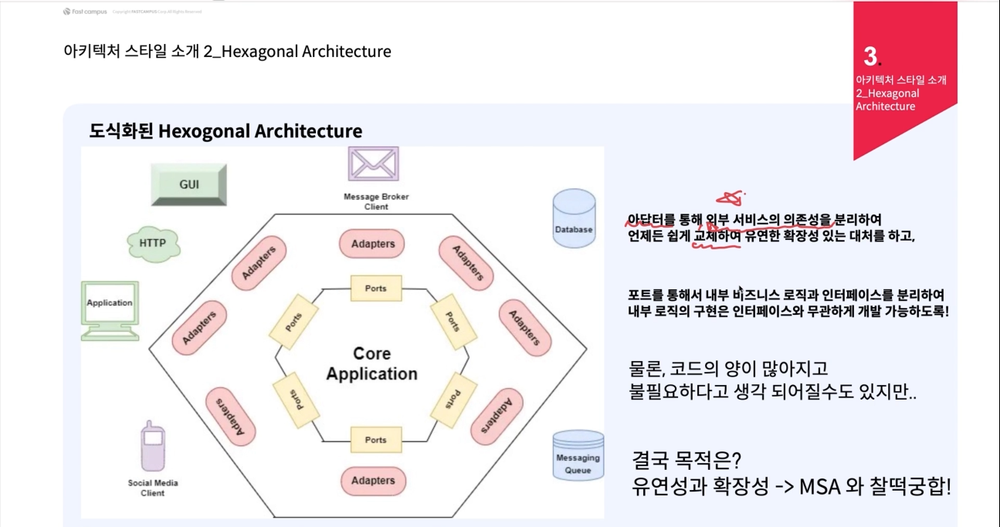

# MSA

## MSA와 소프트웨어 아키텍처의 관계

### MSA는 광의의 소프트웨어 아키텍처

- **즉, 유연성, 확장성, 낮은 응집도/결합도 등 MSA의 특성이 각 Micro Service안에서 필요**
- **당장 요청에 대한 완료 응답을 필요는 없지만, 높은 성능을 요구하는 작업**
  - e.g. 대규모 Command 작업을 수행하는 Cronjob
- 당장 응답해야 하지만, 적은 성능을 요구하는 작업
  - e.g. 일반적인 조회 Query
- **호출하는 외부 서비스의 스팩이 변경되는 경우**
  - e.g. 영향도 없이 빠르게 적용이 필요한 경우
- **통신 방식이 변경되는 경우**
  - e.g. Async 방식으로 변경되어 비동기 Callback 방식으로 로직을 처리해야 하는 경우
**정리하자면 MicroService는 요구사항이 변경되었을때 얼마나 빠르게 적용을 할 수 있는 가가 중요하다.**

**Layered Architecture (계층화 아키텍처)**
- 여러개의 계층으로 나누어 하는 일을 한정 시켜 계층별로 독립적으로 개발, 배포, 확장이 가능하다.
- Presentation / Application / Domain / Infra Layer
- 각 계층 내에서는 코드 수정과 유지 보수가 쉬움

**Hexagonal Architecture (헥사고날 아키텍처)**
- 내부와 외부라는 개념으로 나누어 각각에 맞는 별도의 인터페이스를 정의함
- 모든 비즈니스 로직은, 외부에서 내부 방향으로만 호출이 가능함

### Layered Architecture (계층화 아키텍처)

- 구현에 대한 로직 의존성은 단방향, 접근은 양방향
- Presentation Layer -> Application Layer -> Persistence Layer
- e.g. Business Logic에 포함된 Repo가 존재 할 수 있습니다.
  - 송금 인터페이스를 DAO를 구현 할 수 있습니다.
  - 잔액을 조회해야한다면 그때의 시간 및 고객 정보를 어떠한 순서로 호출해야 하는지 등이 정의 되어져 버립니다.
  - 만일, 이런 로직을 DAO 수정하게 되었는데 그 DAO를 다른 곳에서도 쓰고 있어서 문제가 된다면?
**모놀리스 구조와 계층별로 구분된 일반적인 프로젝트 조직구조에 최적화**

--- 

### Hexagonal Architecture (헥사고날 아키텍처)

- 계층에서 하던 일들을 "내부와 외부" 개념으로 나누어 별도의 인터페이스를 정의하게 됩니다.
- "내부"의 로직은 오직 "외부"를 통해서만 접근이 가능
- 모든 외부 시스템과의 직접적인 상호작용은 "어뎁터"의 역할
- 비즈니스 로직과의 작업을 정의한 곳은 "포트"이다.
- 모든 비즈니스 로직은 오직 외부에서 내부방향으로 호출이 가능하다.
- 인바운드 어뎁터 -> 인바운드 포트 -> 비즈니스 로직
- 비즈니스 로직 -> 아웃바운드 포트 -> 아웃바운드 어뎁터

### 어뎁터와 포트

**어뎁터** : 서비스 입장에서 이 서비스가 사용하는 외부 시스템과의 직접적인 **구현** 및 상호작용을 처리
**포트** : 비즈니스 로직 입장에서 어뎁터와 통신하기 위한 동작을 정의하는 **인터페이스**
  - 어뎁터의 작용을 추상화 하여 나타냄
  - 비즈니스 로직의 입장에서는 DB 접근을 위해서 정의한 Repository는 아웃바운드 포트

**결론** : MSA는 다수의 마이크로 서비스와 소프트웨어 아키텍처의 모음 이므로 빠른 Business Capability 에 대응하기 위해서 헥사고날 아키텍처가 필요하다.