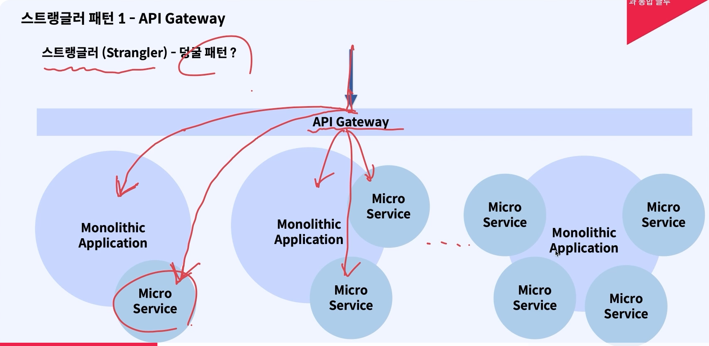
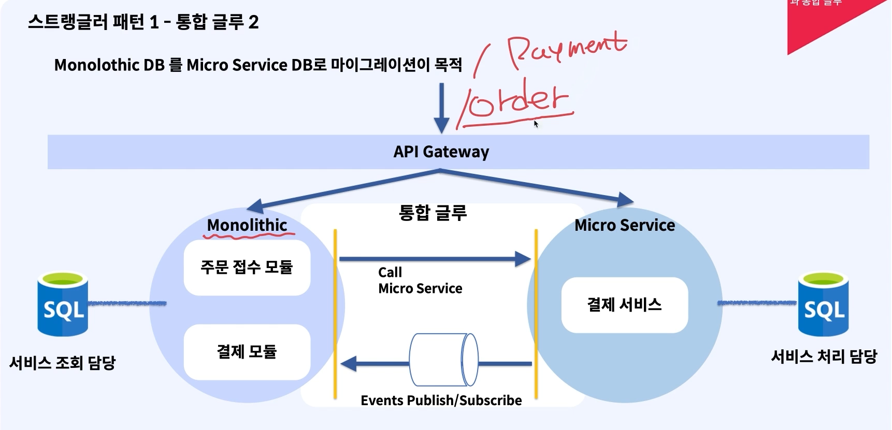

# 모놀리식에서 MSA로의 전환시 고려사항

## 네트워크 지연

**Casa Monolithic to MSA. 배달 주문 앱을 통해, 고객이 카드 결제가 포함된 주문 접수를 요청한다면?**

- 주문 접수 서비스 -> 결제 서비스를 통해서 DB를 조회하고 카드사로 통신(Req / Res)하고 이후에 모바일 클라이언트로 리턴을 할 것입니다.
- 서비스간의 통신이기 때문에 모놀리식 환경이기 때문에 네트워크 지연이 지속적으로 발생 할 것임
- 홉이 늘어나기 때문에 재시도 로직의 고도화, 모니터링 강화등의 작업이 필요하다.

## 트랜잭션

**Casa Monolithic to MSA. 배달 주문 앱을 통해, 고객이 카드 결제가 포함된 주문 접수를 요청한다면?**

**모놀리식**
- 카드사의 실패에 대해서 모놀리식이였다면 결제 모듈이 @Transactional만 사용해도 트랜잭션 컨트롤이 가능합니다.
- 코드 레벨에서 트랜잭션 관리가 가능합니다.
**MSA**
- 트랜잭션을 구현해서 보상 트랜잭션을 보내야합니다.
- Saga Pattern

## 가용성

**요청에 대해서 해야하는 일이 얼마나 오랜 시간 동안 운영이 가능한지를 나타내는 정도**
- MSA라면 네트워크 콜을 하다보니 다음 요청의 스탭이 서비스로 얼마나 잘 갈 수 있는지 알 수 없다.

  
# 스트랭글러 패턴, 통합 글루

- 모놀리식에서 MSA로의 전환은 어렵다. 이를 해결 하기 위한 방안을 알아보자

## 스트랭글러 패턴

- 기존에 식별된 요청으로 나누어 요청하는 패턴

### 스트랭글러 패턴 in 통합 글루 패턴

- 모놀리식 DB를 Micro Service DB로의 마이그레이션이 목적
- 모놀리스 Application과 Micro Service간의 중간 통신 모듈을 두고 서비스합니다.
- 특정 서비스만 일부 Micro Service가 진행이 되었다면 이를 이용해서 서비스의 작업을 진행 시키고 Event 처리를 통해서 모놀리스 Application이 받아서 쓰는 구조입니다.

