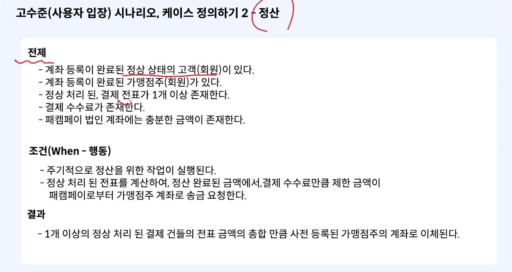
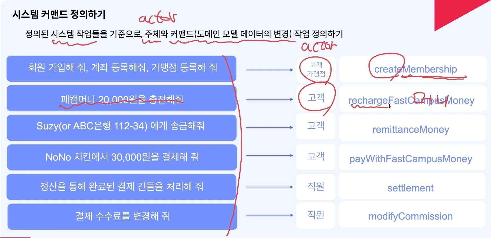
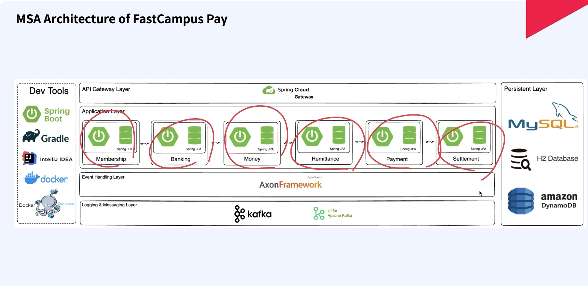
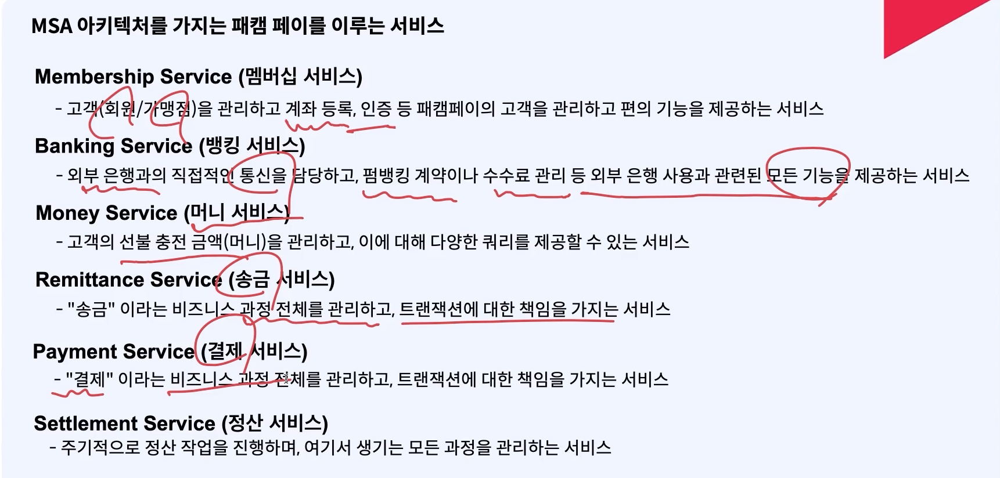

# MSA 아키텍처를 위한 Micro Service를 식별하자 

- (중요도 : 하 -> Product 개발을 위해 정의하는 것으로 MSA와는 연관도가 떨어진다.)

**1단계**
- 기능 요건 정의하기
  - 시스템이 갖춰야 할 요건 정의

**2단계**
- 엑터 및 시나리오 케이스 정의하고 도메인 모델 도출

**3단계**
- 시스템이 해야할 작업 식별하기 (Infra)

**4단계**
- 식별된 작업을 기준으로 서비스 식별하기

## 기능 요건 정의

- 시스템의 주체 정의 -> 고객
- 어떤 수단을 통해서 -> 외부 은행과 통신
- 무엇을 이루고자 하는지 -> 머니 충전, 송금, 가맹점 정산, 결제, 회계 시스템 연계

## 도메인 모델 도출하기

- 기능 요건으로 부터 (펌뱅킹 관리, 정산 주기, 정산 조건 관리 등등) 각 도메인 모델을 도출해보는 작업 진행

## 시나리오 케이스 정의

- given - when - then

## 시스템 커멘드 정의

- actor 입장에서 커멘드의 작업을 정의한다.
- 서비스를 식별하고 효과적인 아키텍처를 디자인하기 위한 작업이다.
- **시스템이 무슨일을 해야하고 어떤 비즈니스/엔지니어링 특성을 가지며 이로 인해 아키텍처에 미치는 영향을 파악**

## 식별된 서비스

- 앞으로 복잡해질수도 있는  도메인을 잘 분리해서 비즈니스 캐퍼블리티를 제대로 유지하면서 처리하기 위해서는 정의가 매우 중요하다.