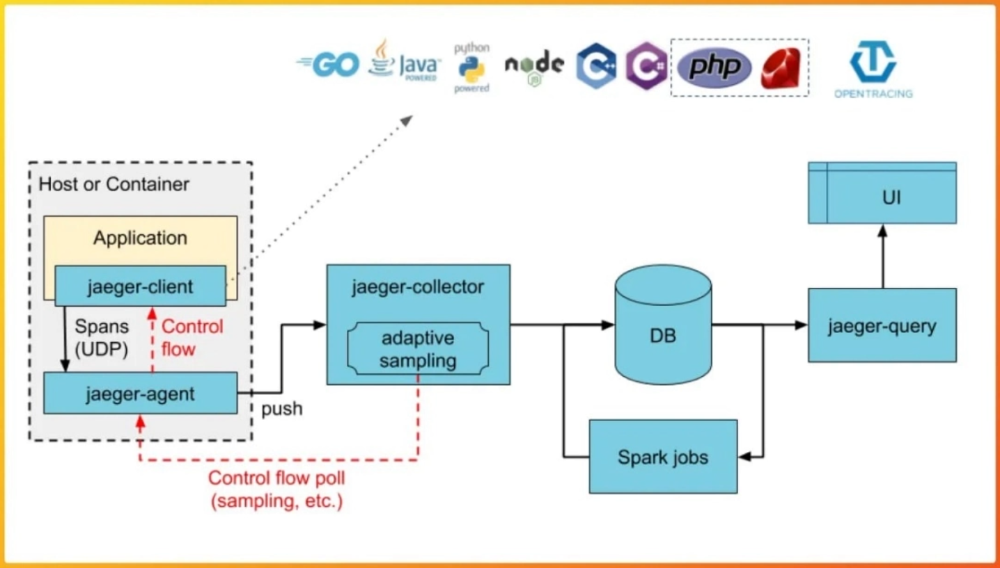

# 분해로 생긴 문제들

## 1. 모듈 간 통신 -> 서비스 간 통신
- Method Call이 Network를 통해서 홉이 생긴다.

**발생 가능한 문제들**
- 각 마이크로 서비스 컴퓨팅 자원 최적화가 어려워짐
- 처리량이 급격히 하락 (특정 서비스에서만 자원이 많이 사용된다면?)
- 디버깅이 어려워 짐
  - 서비스가 분리됨에 따라서 JVM 최적화가 어려워 집니다.

## 2. 모니터링 방식의 변경

- 모놀리식 환경
  - Node Exporter를 활용하여 Node (DB) 상태에 집중
- MSA 환경
  - Node 상태뿐만 아니라, 서비스 간 호출 상태 파악
    - Latency 증감 확인, Call 확인
    - API 호출 중임을 확인
    - Async 방식으로 동작중인 Kafka 등에 대해서도 모니터링 필요

**발생 가능한 문제들 2**
> hop이 늘어남에 따라, 어디서 어떤 요청에 대한 문제가 발생했는지 어려움
> - 서비스의 갯수가 늘어남에 따라서 어느 요청에서 문제가 발생했는지 알기 어려움
> - 어느 서비스에서 얼마나 자원이 필요할 지 정확히 알고 있어야 합니다.
- 로그 수집을 위한 별도의 인프라 필요 및 관리 필요성
  - 로깅 누락, 간단히 Loki를 쓰자.. 이럴 수는 없는 것
- 수십 수백개의 서비스에 대해서 JVM / HW 얼마나 정상적인지 지속적인 확인이 필요합니다.
  - 서비스에 문제가 생기더라도 문제 감지가 무뎌질 수 있습니다.
- **어느 서비스에서 어느 서비스로 호출**이 되어야 하는지 옳은 상태인지 파악이 어려움

## 분해로 인해 생겼던 문제들을 해결하는 방법

- Docker Container를 활용하여 각 서버로 관리
- K8S로 수 많은 컨테이너를 관리

- hop이 늘어날 때 어디서 어떤 요청이 문제인지는 **Tracing**을 통해서 파악
- 로그 수집 및 검색 인덱싱은 **Logging** (Loki, Logstash) 을 통해서 파악
- 수십 수백개의 서비스에 대해서는 **Metric, Alert**을 통해서 파악
- 어떤 서비스에서 어느 서비스로 호출이 되어야 하는지는 **Service - Mesh**를 통해서 파악

## MSA 환경에서의 모니터링

### 모니터링

1. 특정 Metric에서 이상이 생기면 무조건 Alert을 통해서 문제를 감지해야 함
2. 어떤 Metric에 대한 문제인지 파악 후 대응
   1. Application level이면 Log 확인
   2. 로그로 단순 확인이 어려울 시 Tracing 확인
   3. 인프라 수준의 문제라면 정확한 원인 파악 필요

### 로깅 (Logging)

- Disk 내의 Log file 위치 -> Logstash, Fluentbit, Fluentd(로그 수집기) -> Loki, Elastic Search (indexing) -> Kibana, Grafana

### 메트릭 (Metric)

- System metric(Node, Pod, etc...) -> Promethus, InfluxDB (Pull 방식의 구현, 일부 Micrometer와 같은 JVM Library 지원 건들은 직접 Push 방식으로 구현되기도 한다.) -> Grafana

### 트레이싱 (Tracing)

- 하나의 소스(트랜잭션)에 대해서, 여러개의 서비스에서 어떤 과정을 거쳐 수행되었는지 확인이 필요합니다.
- Transaction -> Jaeger, ZipKin, Tempo
- 
  
### 서비스 메시 (Service Mesh)

- 어느 서비스가 어느 서비스를 호출하고 있는지, 어디로 트래픽이 발생하고 있는지 모니터링이 될 수 있도록 관리
- istio, envoy-proxy