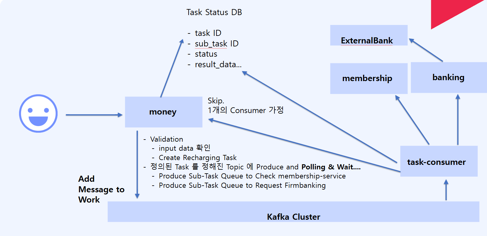

# Kafka를 이용한 Async 방식의 IPC 통신

## Kafka 동작

1. 아래 내용으로 Kafka에는 Money Service에서 IPC 통신 검증 요청으로 요청을 보냄
   1. CountLatchManager에게 taskID 값 기반으로 addCountLatch 후 await 한다.
2. task-consumer는 (payment.task.topic) -> 로 아래 정보를 읽어서 external Port 통하여 각각 member, banking 서비스가 정확히 존재하는 계좌인지 판단 후  success 이면 payment.task.result.topic으로 전송한다.
3. MoneyService의 Adapter.in.kafka의 RechargingMoneyResultConsumer가 이를 읽고 판단 후 CountLatchManager를 컨트롤한다.
4. Response 값을 상황에 따라서 리턴한다.   

