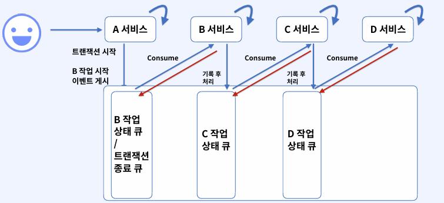
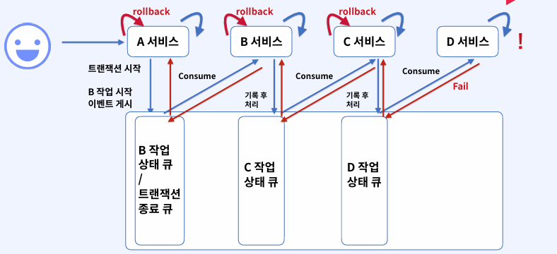
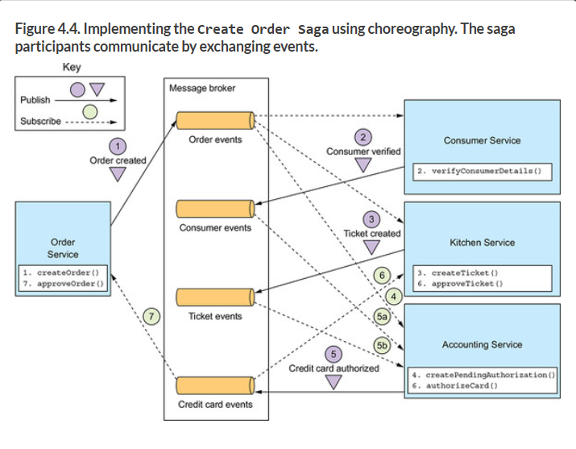
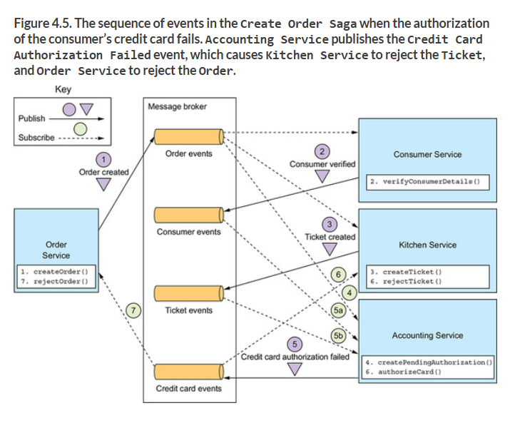
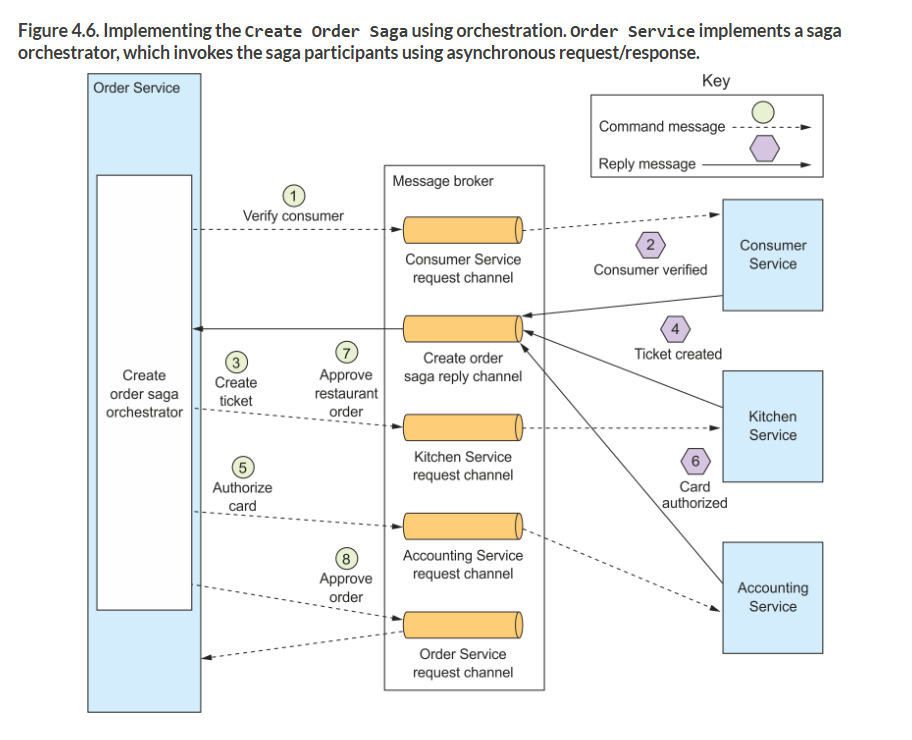

# SAGA Pattern

- 이벤트 방식으로 트랜잭션에 포함된 여러 작업의 결과를 게시하고, 이벤트를 비동기 처리하여 다음 작업을 진행
- 사전에 작업의 순서와 의존성을 정의 해두고 작업 1 -> 작업2 이렇게 수행 뒤에 모두 작업이 완료됨을 서비스 완료 를 컨슘해서 비동기로 확인하고 이를 처리하는 방식으로 구현합니다.

**Normal Pattern**

**Abnormal Pattern**

-> 실패처리가 각 서비스의 의존성에 의해서 모두 Rollback 수행

**Payment 서비스에서 구현**
1. 송금 서비스 수행
2. 머니 서비스 컨슘
   1. 잔액 부족 여부 체크
   2. 결과 이벤트 게시
      1. 뱅킹 컨슘 후 펌뱅킹에 외부 은행 정상 유무 판단
      2. 결과 이벤트 게시
         1. 머니 컨슘
            1. 정상이라면 잔액 증가
            2. 실패 시 Fail 수행
            3. 뱅킹 Fail
            4. 송금 Fail

---

**코레오그레피 패턴**
- SAGA 패턴을 Ochestrator를 두지 않고 SAGA 구현
**오케스트레이션 패턴**
- 독립적인 Ochestrator를 두고 SAGA를 구현

## 코레오그레피 패턴
- 정상 케이스

- 문제 발생 케이스

1. 컨슈머, 키친 서비스는 완료 되었으나 결제 이벤트에서 문제가 발생하였습니다.
2. Credit Card Queue에 실패 이벤트를 보냅니다.
3. 키친 서비스는 rejectTicket()이라는 호출을 다시 Ticket Event Queue에 넣습니다.
4. 이후 회원 서비스는 확인 후 OK
   1. 회원 서비스는 그저 회원이 정상인지만 호출 했기 때문임 별도 다시 rollback 될 것이 없음 (Not Post)

출저 : https://livebook.manning.com/book/microservices-patterns/chapter-4/72

### 특징
- 각 서비스 입장에서 수행하여야 하는 트랜잭션과 이벤트를 Publish하는 작업이 무조건 하나의 처리로 묶여야 한다.
- 전체적인 복잡한 비즈니스에서는 SAGA 패턴의 유지보수가 어려워집니다.

## 오케스트레이션 패턴

**정상 케이스**

- 각 서비스는 특정 작업을 요청하기 위한 이벤트를 발행하고 이를 받는 것은 오케스트레이션이다.
- 오케스트레이션이 이를 보고 판단해서 다음 서비스로 이벤트 허용을 날려주고 다음 서비스가 판단해서 최종 Commit등을 수행함
- 그림간에서는 서비스 내부에서 오케이스트레이션을 구현했으나 따로 인프라를 생성해서 관리하는 경우도 있음

### 만일, 실패 시에는 어떻게 수행이 될까?

1. 결과에 대해서 오케스트레이터가 이벤트 결과 실패를 받게 됨
2. SAGA의 내부의 순서와 의존성에 대한 정보는 오케스트레이터가 알고 있으니 이전에 실행한 요청에 대해서는 오케스트레이터가 롤백 요청을 보냄
3. 각 서비스는 이벤트 큐를 보고 다시 롤백을 수행합니다.

**특징**
- 추가적인 인프라를 사용하기 때문에 이를 관리하는 대책이 필요
- 각 서비스에는 자신의 서비스의 보상 트랜잭션만 구현하면된다.
- 트랜잭션에 대한 비즈니스 로직이 오케스트레이터에 포함 될 수 있습니다.
  - 2번의 응답에서 Status가 1이면 3으로 가고 2이면 4번 서비스로 간다고 하면 절대로 경계해야 할 부분이며 이렇게 변경이 되는경우에는 사용하지 못한다. 무조건 결과는 **static**해야 함

