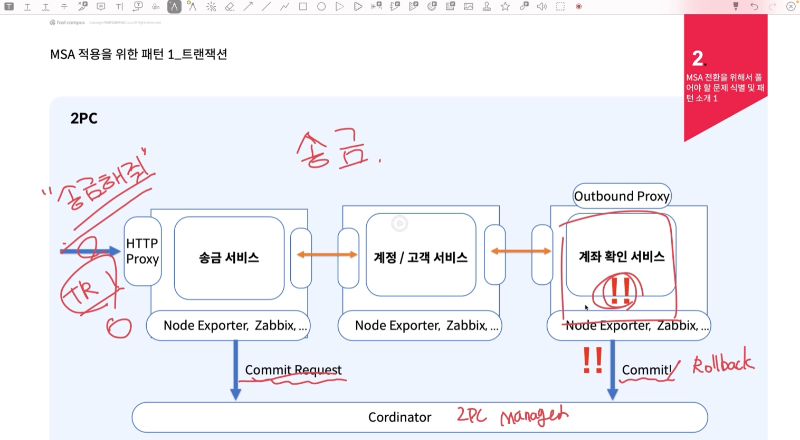

# MSA

## 분산 시스템의 어려움

### Transaction

- 송금/충전 서비스 -> 계정/고객 서비스 -> 계좌 확인 서비스 -> 외부 은행 CP
  - 이런 시스템에서 만일 통신 도중 실패하게 되면 어떻게 해야 할까?
  - 2PC (Two Phase Commit), 보상 트랜잭션 - Saga
- Data Query의 어려움
  - 잔액이 부족하여 실패한 송금 요청은 얼마나 발생 했는가?
  - Join 한 두번으로 끝날 쿼리가 MSA 에서는 굉장히 어려워 진다.

### Monitoring

- 시계열 DB를 사용하여 모니터링
- Node Exporter 통해서 Promethus가 System metric을 pull해 값니다.
  - 매트릭 수집을 위해서 Application의 성능을 떨어트릴 수 없기 때문에 Pull 해서 가져갑니다.
  - 다만, Cron 패턴 환경에서는 Push 방식을 사용하기도 합니다.

### Pattern

1. **분해 패턴** : 모놀리식 구조를 어떤 판단 기준에 따라서 서비스를 분리할 것인지에 대한 패턴
- **비즈니스 능력에 따른 분해** : 복잡한 "비즈니스 능력"을 기준으로 분해
- **하위 도메인 패턴별 분해** : 복잡한 비즈니스의 하위 도메인 단위별로 분해 
  - 예시) 송금 서비스를 계좌 도메인, 내부 머니 도메인, 뱅킹(외부 은행과 통신만을 담당)
---
** AML : 자금 세탁 방지  

** CTR, STR : 고액, 의심 현금거래  
위의 내용은 금융 서비스를 작성하기 전 이해를 돕기 위함
---

2. **통신 패턴** : MSA 설계를 통해서 도출된 서비스 간 어떤 통신으로 할 지 결정하는 패턴  

- **Sync Pattern (동기 패턴)** : HTTP(RESTful), gRPC 과 같이 Request 이후, 그 Response를 받을 때까지 멈춰 있어도 되는 경우
- **Async Pattern (비동기 패턴)** : Kafka를 이용한 Message Queue, Callback, Polling (일정 주기마다 확인) 방식..과 같이 다른 서비스로 Request를 넘기고 Response를 바로 받지 않아도 되는 경우

---

3. **Transaction Pattern (트랜잭션 패턴)** : 2PC (two phase commit) 이용  

- **2PC** : 커밋을 해도 되는지 확인함
  - TR1의 트랜잭션이 실패했지만 특정 서비스에서 아예 장애가 나서 안 될 가능성이 큼
  - 
- **보상 트랜잭션** : 완전히 종료된 트랜잭션을 이전 상태로 돌리기 위한 "행동"
  - 앞서 정의된 서비스에 대해서 모두 보상 트랜잭션을 날리게 됩니다. (A -> B -> C) 에서 C가 장애가 났는데 A가 그 보상 트랜잭션을 받지 못 할 수도 있습니다.
  - 가능하다면 MSA 내부에서 서로 트랜잭션을 침범하지 않는 것이 좋다고 합니다.
- **Saga Pattern** : 트랜잭션의 선후 관계를 확인하고 경우에 따라서 Cordinator가 보상 트랜잭션을 이용, 관리
  - A -> B -> C에서 A 서비스에서 제대로 커밋이 되면 Saga가 시작이 되고 마지막 C에서 문제가 생긴다면 Saga에게 알려주고 Cordinator가 보상 트랜잭션을 쏘게 됩니다.
  - Saga가 시작되고 나서 트랜잭션 종료가 되지 않는다면 자동으로 보상 트랜잭션을 날려버립니다.

