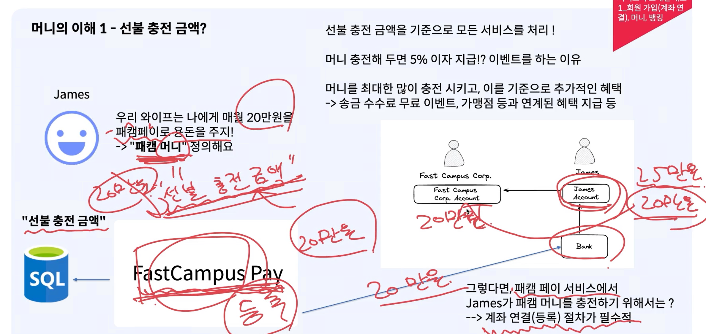
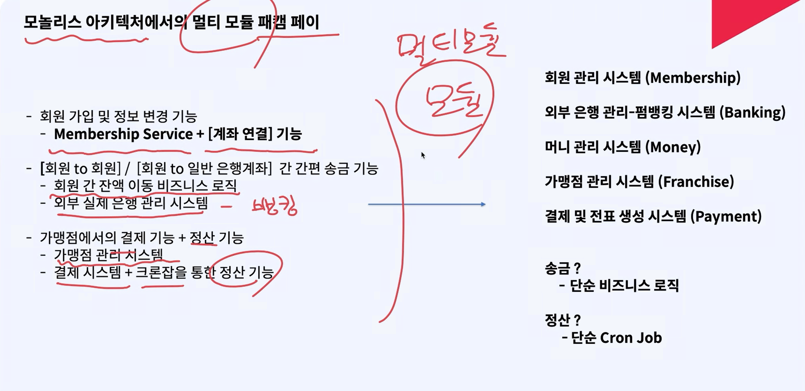
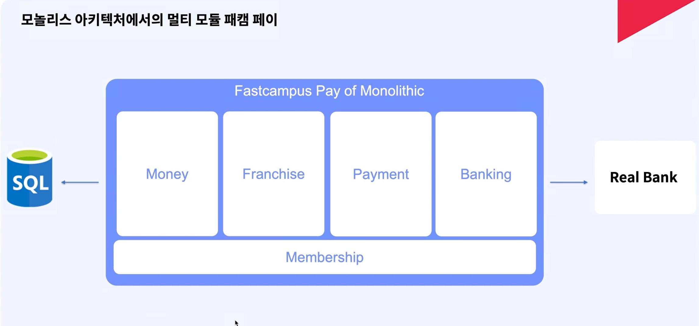

## 페이먼트 시스템의 제작

- [회원 to 회원], [회원 to 일반 은행 계좌]
- 가맹점 결제 기능 + 가맹점 정산 기능

## 머니의 이해 - 1

- 머니는 선불 충전 금액으로 의미합니다.
- 그러면 페이 서비스에서 머니를 충전하기 위해서는 계좌 연결 절차가 필수적임
  - 왜냐하면 실제 계좌에서 머니를 빼서 충전해야 하니까요.
  - 머니를 충전한다는 말은 페이먼트 시스템의 법인 계좌에 현금이 충전된다는 의미임
- 

## 머니의 이해 - 2 (펌뱅킹)

- 10,000원씩만 충전되던 이유
- 송금 메뉴에 가면, 각 서비스마다 이체 가능한 은행 목록이 다른 이유
  - 계약 관계가 서로 이루어지지 않기 때문임

### 펌뱅킹

- 은행의 기능을 시스템적으로 이용하기 위한 수단
- 개별 은행마다 별도의 계약을 맺고 수수료 지불이 필요하다.
  - 즉, 10,000원만 넣으려고 하면 일정 이상의 수수료가 머니 서비스가 내야하는 값이 커진다.
- **뱅킹** : 외부(은행)을 호출하기 위한 작업

## 송금

- **[회원 to 회원]**
  - 단순 선불 충전 금액의 이동 트랜잭션을 실행한다.
- **[회원 to 일반 은행계좌]**
  - 선불 충전 금액에서 타행 실제 계좌로의 금액 이동 필요
  - 회사 입장에서는 **회원 to 회원**이 이득

### 송금 기능이 해야할 일?

**[회원 to 회원]**
- 서비스 로직 - DB Transaction

**[회원 to 일반 은행 계좌]**
- 외부 은행과의 통신 모듈 - "뱅킹"

### 결제 기능이 해야할 일?

- 회사는 고객의 전표를 거치고 나중에 사장한테 전표를 전달하여 할 수 있게한다.
  - Pay money를 통해서 사실상 법인 결제가 이루어지는 것임

### 정산 기능이 해야할 일?

- 승인된 전표를 가지고 돈을 정리하는데 이 정리하는 주기가 있기 때문에 사장에게는 정산이 늦어질 수 있다.
  - "간편결제 도메인이 욕 먹는 이유..."

# 모놀리스 페이먼트 시스템

## 모놀리스 페이먼트에서의 멀티 모듈 페이먼트 시스템

- One DB 기준으로 논리적인 아키텍처의 설계를 진행하였습니다.