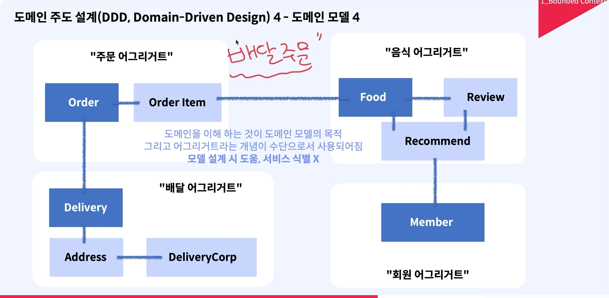

# 분해/통합 = 비즈니스 능력 기준으로 서비스를 정의 하는 일

## 왜 분해 / 통합이 어려울까?

- **MSA에서 분리 / 분해는 Business Capabaility를 가질 수 있는 방향으로 서비스를 정의하는 일**
- 각 서비스 간 적절한 Business Capability를 가질 수 있도록 적절히 서비스를 정의

## 비즈니스 동작 기준으로 분해

**사용자 입장**에서 비즈니스 요청을 식별

**장점** : 비즈니스 동작 자체만으로 매우 중요합니다. 그리고, 비즈니스의 변화가 적을 경우 "적절합니다." (비즈니스 로직끼리 응집성을 가져야 하는 경우)

**단점** : 외부 서비스와 통신이 빈번하게 필요한 경우에서는 제한적임
  -> 새로운 고도화 비즈니스가 생길 수 있습니다.

## 하위 도메인 패턴을 기준으로 분해

- **도메인** 복잡성을 이해하고, 도메인의 문제를 해결하는 것에 집중하여 분리/분해
- **즉, MSA에서의 하위 도메인을 이용한 분리/분해는 필요에 따라서 Business Capability를 높이기 위해 분리/분해 하는 것이 목적**

# What is DDD?

## 도메인 주도 설계 (Domain-Driven Design)

- 복잡한 도메인을 이해하고 해결하는 목적

**핵심 개념**
- 하위 도메인
- 공통 언어 약속 (유비쿼터스 언어)
  - 복잡한 도메인을 이해하기 위해 도메인 전문가와 소통하기 위한 언어 (비개발자와 소통하기 위한 언어)
- 도메인 모델
  - 문제 요구사항을 잘 표현하기 위해서 도메인의 핵심 개념과 규칙을 표현하는 **객체들의 관계**
    - e.g. "주문 서비스" : 음식적의 음식을 주문 할 수 있다. 
    - "음식 관리 서비스" : 음식의 종류나 주문 가능한 음식
    - "배달 서비스" : 적절한 배달원과 매칭 
- Bounded Context

### 도메인 모델
**Entity** : 하나의 객체 및 하나의 테이블 모델로써 존재 할 수 있는 데이터의 모음
**Aggregate** : 데이터를 변경 할 때 데이터 변경의 단위 및 연관된 엔티티, 객체들의 묶음 (관련된 객체들의 집합)
**Aggregate Root** : 어그리거트(집합)에서 도메인의 줌심을 의미하는 엔티티를 의미
- e.g. Order Aggregate: "Order(Aggregate root), OrderItem"
- 도메인 모델은 각각의 도메인을 이해하기 위한 수단이지 실제 서비스를 나누는 개념이 아니다.

### Bounded Context

- 각 모델들은 상호 베타적인 문제를 해결해야만 한다.
- 각 모델들은 명확한 바운더리를 가져야한다.

### 하위 도메인

- Bounded Context 원칙에 따라서 Business Capability를 높일 수 있는 방식으로 분리해야 한다는 원칙
- 어그리거트 루트로 분리된 어그리거트는 하위 도메인이다.
- **하위 도메인이라는 개념을 이용하여 서비스를 식별하자**

## 분리 지침

- **단일 책임 원칙 (SRP)** : 각 클래스는 하나의 책임을 가져야 함 ("주문" -> 주문 접수, 주문 결제, 주문 추천)
- **공동 폐쇄 원칙 (CCP)** : 동일한 사유로 변경되는 클래스들은 동일한 패키지에 두어야 한다. ("주문 결제" 패키지와 "결제 이력 패키지"는 동일한 패키지에 있어야 한다. 주문 결제시 이력이 업데이트 되니깐)
