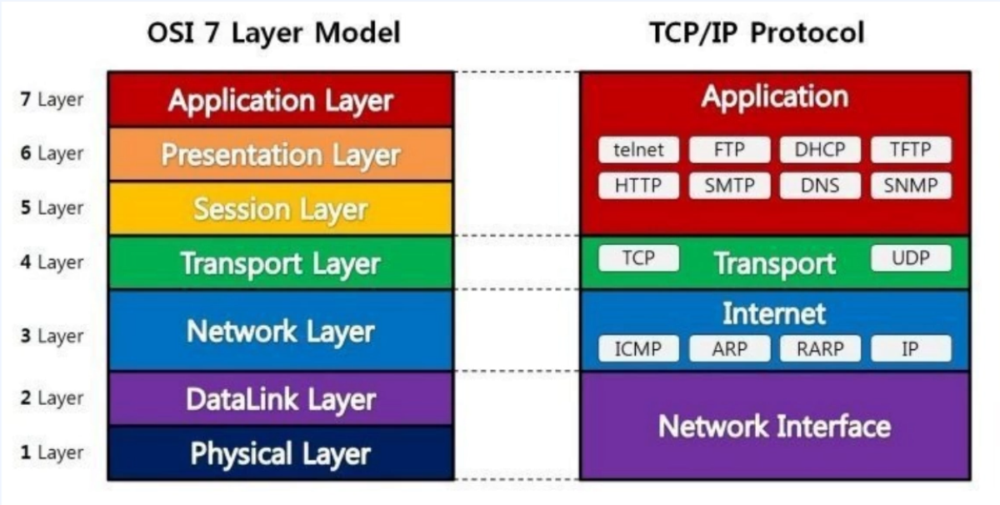

# IPC를 위한 패턴

- IPC : Inter Process Communication
- "프로세스 간 통신" -> "서비스 간 통신" -> MSA
- 
- TCP -> HTTP
- 일반적인 IPC는 크게 2가지로 나뉨
  
## Sync(동기) 방식

- Response를 기다린다. (HTTP, gRPC 방식)
- 선행작업이 필수적인 경우
- 비교적 빠른 작업인 경우

### HTTP (Sync)

- **PUT** : **멱등성** 필수, 리소스 변경을 위한 메서드
- **DELETE** : 리소스를 삭제하기 위한 메서드
- **POST** : 리소스를 생성하기 위한 메서드
- **GET** : 리소스를 가져오기 위한 메서드

### gRPC (Sync)

- Protocol Buffer를 기반으로 하는 원격 프로세저 호출 프레임 워크
- Server to Server Call에서 사용 (Proto 파일을 가지고 직접 서버가 소통해야 함)
- 각 언어마다 스텁을 생성해서 통신을 해야 합니다.
- Risky 함

## ASync(비동기) 방식

- Queue를 이용해서 Produce, Consume을 하는 방식으로 통신을 함
  - MQTT, Kafka, RabbitMQ
- 매우 복잡하고 리소스 소모가 많은 작업의 경우
- 비교적 한정된 컴퓨터 리소스를 가지는 경우
- 응답 대기시간을 최소화 하기 위함
- MSA 환경에서 Event Bus로 통신해서 필요한 것만 통신 해서 쓸 수 있으니 결합도도 낮추고 Queue에 이미 들어간 데이터는 장애가 나더라도 복구 가능하니 사용하는 것이 좋다.

**MQTT**
- 경량 메세지 프로토콜, IoT등 경량화가 최대 목적인 프로토콜
- Publish, Subscribe, Topic 모델 사용

**AMQP**
- 엔터프라이즈 레벨의 메세징 시스템을 위한 프로토콜
- MQTT 개념 외에도, Exchange, Binding등의 개념 추가
- Rabbit MQ, Active MQ

## AMQP의 구성 요소

- 메세지 발행자 (클라이언트 서버)는 Exchange만 바라보고 Exchange는 라우팅 역할만 합니다.
- 중간 버퍼 계층이 Queue로 존재하기 때문에 유연하다.

## Kafka
- Kafka는 MQTT도 AMQP도 아니다. 표준 프로토콜이 아닌 데이터 스트리밍 플랫폼입니다.
- 비교적 복잡하나 성능(메세지 처리량)은 압도적입니다.

### Kafka의 구성 요소

- Topic : Producer - Consumer의 메세징 객체
- Partition : Topic을 물리적으로 분할하고, 처리
- Broker : Kafka의 각 노드를 의미
- Zookeeper : Kafka 클러스터의 메타 데이터를 관리

## Async 통신의 단점

- 1 Produce에 1 Consume만 되는 것은 물리적으로 불가능합니다.
  - Consume을 할 때 데이터를 받아서 처리하고 처리를 마쳤으나 Handling 하다가 컨슘 서버가 꺼진다면 Commit 이라는 동작이 들어오지 않으니 Consume하고 Handling 하다가 죽으면 물리적으로 큐가 컨슘 서버의 Commit 을 알 수 없습니다. 
  - 그래서, 이럴 때 Queue는 두 번 이상 요청을 줘서 컨슘 서버로 응답을 받을 수 있습니다.
    - Exactly Once를 위해서는 추가적인 인프라 구성이 필요함