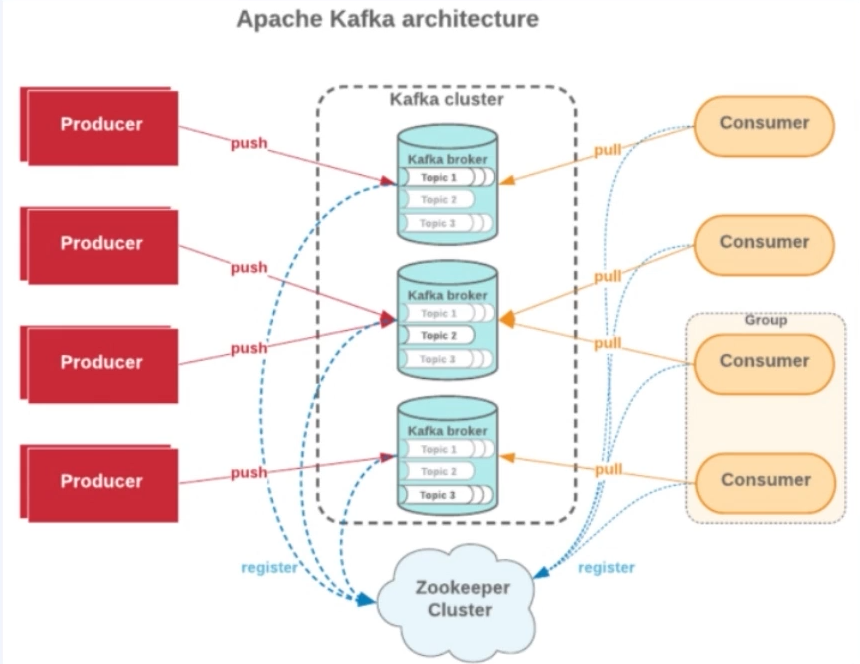

# Kafka

- Kafka는 실시간 이벤트 스트리밍 플랫폼
- 확장 용이성, 고성능 실시간 데이터 처리
- 고가용성, 고성능
- 규모가 작은 비즈니스에서는 비적합한 오픈 소스이다.
- 실시간성이 큰 서비스라면 사용하는데 적합하다.

## Why Kafka?

- **대규모**의 실시간 이벤트/데이터 스트리밍이 필요한 비즈니스에 적합하다.
- -> 트위터, 카카오, 넷플릭스, 우버

## Kafka의 기본 개념

**Producer**
- 메세지를 발행하는 **주체**
- Producing 자체가 메세지를 발행하는 동작

**Consumer**
- 메세지를 소비하는 **주체**
- Consume 자체가 메세지를 가져와 처리하는 동작

**Consumer Group**
- 메세지를 소비하는 **주체 집단**

## Kafka 기본 개념 (Cluster, Topic)

**Producer**
- **Kafka Cluster**에 존재하는 **Kafka Broker**에 발행하고 이를 **Broker에 있는 Topic**에 메세지를 발행하는 **주체**

**Consumer**
- **Kafka Cluster**에 존재하는  **Kafka Broker**에 소비하고 이를 **Broker에 있는 Topic**의 메세지를 처리하는 **주체**

**Apache Zookeeper**
- 분산 처리 시스템에서 분산 처리를 위한 코디네이터
- **누가 리더인지, 어느 상황인지, 동기화 상태등을 관리**
- Kafka Cluster를 관리함 (K8S의 마스터 노드와 같은 역할)

## Kafka Topic?
- 메세지를 발행하고 소비 할 수 있는 객체(Object)
- Kafka Topic은 고가용성, 고성능을 구현하는 핵심 개념임
- **비즈니스 별로 토픽 설정 값이 달라 질 수 있다.**

## Kafka Topic (파티션)
- 토픽은 1개 이상의 파티션으로 이루어져 있습니다.
- 하나의 토픽에 포함된 메세지들을 물리적으로 분리하여 저장하는 저장소로 
- 하나의 메세지가 하나의 파티션에 들어가는 형태로 구현 되어 있습니다.
  - Not Sharding it's Partitioning!
- Topic에 Partition은 하나의 메세지가 하나의 Partition 한 개에 들어갑니다. (샤딩 처럼 모든 곳에 나누어져 들어가는 형태가 아닙니다.)
- **파티션 -> 성능과 직결되는 요소입니다.**
- 일반적으로 파티션이 많으면 성능이 향상되어집니다.